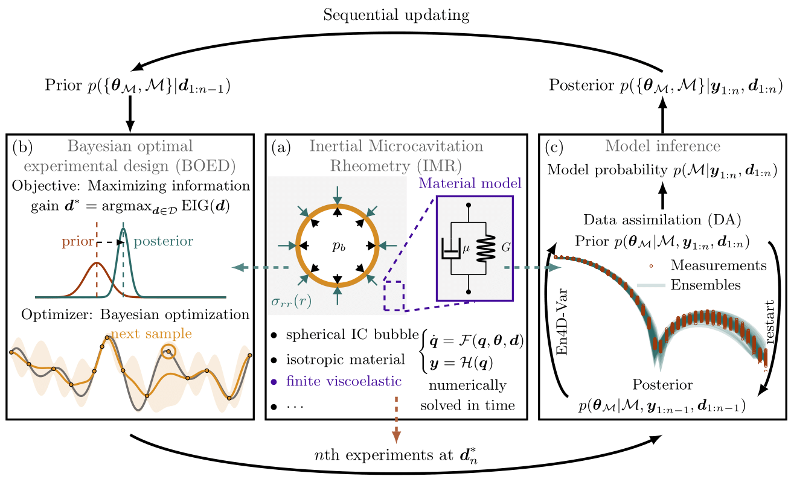

# IMR-based sequential BOED

An optimal sequential experimental design approach is developed to characterize soft material properties at the high strain rates associated with bubble cavitation. The Inertial Microcavitation Rheometry (IMR) approach is used to numerically solve the spherically symmetric motion of bubble dynamics. 
* The current version is based on the main-release repository, `IMR_v1`. For more details, see [here](https://github.com/InertialMicrocavitationRheometry/IMR_v1).

## Overview

The optimal design procedure aims to find an experimental setup (e.g., the equilibrium radius), denoted by $\mathbf{d}$, that can provide the most informative data about unknown parameters. 
In the context of inertial cavitation, the modeling parameter includes a constitutive model and its material properties, denoted as $`\mathbf{\theta}=\{\mathcal{M},\, \mathbf{\theta}_{\mathcal{M}}\}`$.
In computation, the complete flow states $\mathbf{q}$ include bubble radius, bubble-wall velocity, temperature, and other variables, but they are only partially observable and are denoted as $\mathbf{y}$. The process for the IMR-based sequential BOED is described as follows:
* Optimal design: Maximizing the expected information gain (EIG) using Bayesian optimization (BO) to design the most informative cavitation experiments.
* Model inference:
  * Data assimilation: Characterizing the unknown material properties, $\mathbf{\theta}_{\mathcal{M}}$, by analyzing the bubble dynamics trajectories, $\mathbf{y}$, using En4D-Var.
  * Bayesian model selection: Using the marginal likelihood to calibrate the probability of each constitutive model, $\mathcal{M}$.
    
When the prior is updated using the posterior, one iteration of the sequential design is completed. Soft material properties are shown to be accurately and efficiently characterized by iterating optimal design and model inference processes.

## Summary of available constitutive models

| Model $\mathcal{M}$  | Description                | Material properties $\mathbf{\theta}_{\mathcal{M}}$  |
| ---:                 |     :---:                  |    :---                                              |
|                      | Newtonian Fluid            | $1/\mathrm{Re}$                                      |
| NHE                  | Neo-Hookean Elastic        | $1/\mathrm{Ca}$                                      |
| NHKV                 | Neo-Hookean Kelvin--Voigt  | $1/\mathrm{Re},1/\mathrm{Ca}$                        |
| SNS                  | Standard Non-Linear Solid  | $1/\mathrm{Re},1/\mathrm{Ca},1/\mathrm{Ca_1}$        |
| qKV (fung)           | Quadratic Law Kelvin--Voigt| $1/\mathrm{Re}, \alpha,1/\mathrm{Ca}_{\infty}$       |
| Gen. qKV             | Generalized qKV            | $1/\mathrm{Re},\alpha,1/\mathrm{Ca}_{\infty}$        |
| $\vdots$             | $\vdots$                   | $\vdots$                                             |

The current design approach supports all the constitutive models released in `IMR_v1`.

## Implementation

Run `IMR_design.m` to obtain the design results for the first example case considered in the manuscript. The main functions are:

* Simulations:
    * `IMR_simulation()` generates IMR simulations in a parallel environment.
* Optimal design:
    * Given the prior distribution, `IMR_EIG()` evaluates the EIG for a particular design, $\mathbf{d}$.
    * `BayOpts_IMR()` outputs the optimal design, $\mathbf{d}^*$, using BO.
* Data assimilation:
    * `IMR_DA()` performs the En4D-Var process for a given constitutive model and outputs the posterior ensembles.
* Bayesian model selection:
    *  `Model_prob_est()` calculates the marginal likelihood of each mathematical model.
 
       
 ## Citation

Chu, T., Estrada, J. B., & Bryngelson, S. H. (2024). *Bayesian optimal design accelerates discovery of material properties from bubble dynamics.* arXiv: 2409.00011. See [here](https://arxiv.org/abs/2409.00011).
